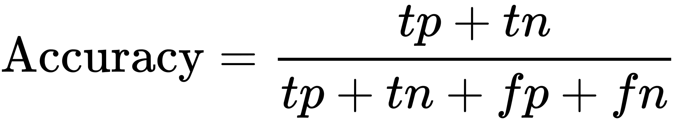
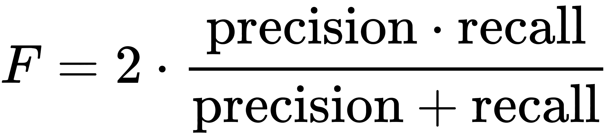
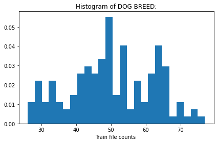
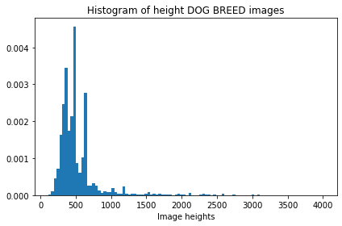
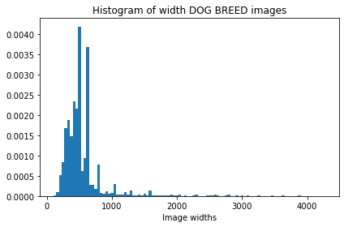
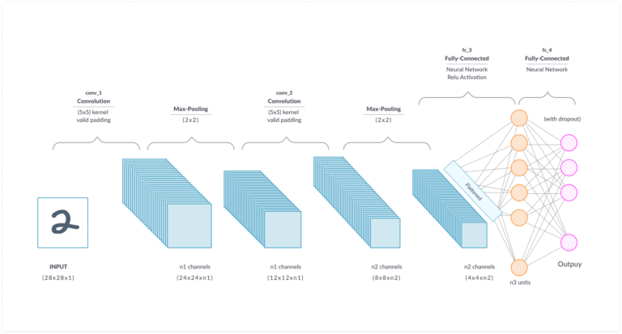
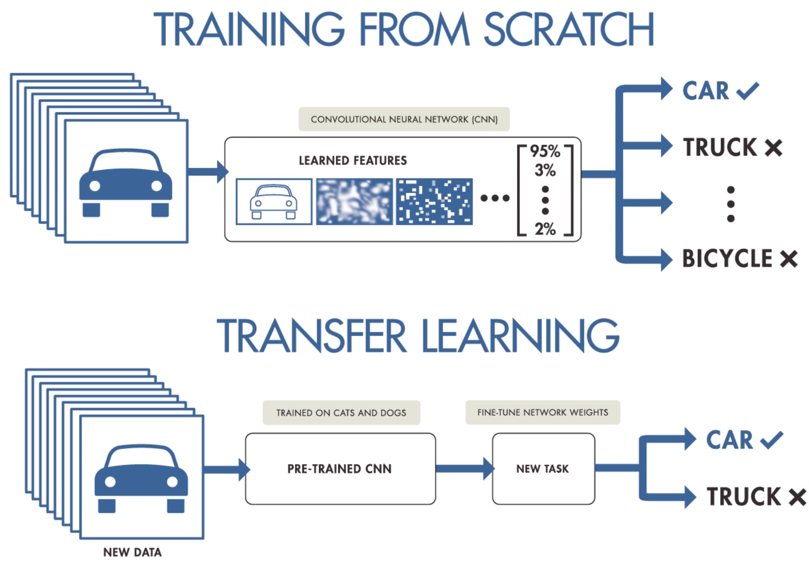
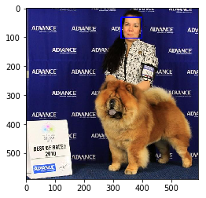

# Machine Learning Engineer Nanodegree
## **Capstone Project: Dog Breed Classifier**
Francesco Paolo Albano
Github Repository: [link](https://github.com/PaoloAlbano/project-dog-classification-udacitynanodegree)

24/06/2020

## I. Definition
### Project Overview
The goal of this project is to develop a model that given an image, it will predict the dog's breed. This model is mounted in a inference pipeline that recognizes if in the photo there is a human face or a dog. If a dog is detected in the image, the dog's breed model is invocated. If a human is detected, it will provide an estimate of the dog breed that is most resembling. If neither is detected in the image, the pipeline will return a message of no prediction. This is a classic computer vision supervised machine learnin problem, targeted to multi class image classification for the dog's breed. The datasets, provided by Udacity, are two, the first is a dataset of dog images divided by breed, the second is a dataset of human faces (the famous flw dataset<sup>1</sup>).
All the project was executed on a notebook equipped with a CPU i7-7700HQ and a GPU Nvidia Quadro M1200.

### Problem Statement
The inference pipeline needs two different models to solve the problem *Classify the dog's breed from an image sent by a user*. So we need of:
* Model for human face identification
* Model for dog identification
* Model for dog's breed classification

#### Human face identication
To solve this task, we can simply use a pretrained model based on Haar Cascade Classifier. Haar Cascade is a machine learning object detection algorithm used to identify objects in an image or video and based on the concept of ​​ features proposed by Paul Viola and Michael Jones in their paper "Rapid Object Detection using a Boosted Cascade of Simple Features"<sup>2</sup> in 2001. We have choosen the implementation from OpenCV package<sup>3</sup>. 

#### Model for dog identification
To identify if an image represents a dog, the pretrained VGG16 will be used. We have choosen the pretrained model from torchvision package <sup>4</sup>. This model is pretrained on ImageNet, a very large, very popular dataset used for image classification and other vision tasks. Looking at the ImageNet dictionary we can find that the categories corresponding to dogs appear in an uninterrupted sequence and correspond to dictionary<sup>5</sup> keys 151-268.


#### Breed dog classification
To solve this task, we need a CNN model that is able to distinguish the breed of dog. The first approach is to build and train a CNN model from scratch, but the accuracy obtained was 24% which is resonable because of very simple architecture. Then we have using the tranfer learning to increasy accuracy and speed up the time to training. Using transfer learning on the Resnet18 model, from torchvision package, we are able to achieve 77% with very little effort and few training epochs.
The choice fell to the ResNet18<sup>6</sup> because have very good performance despite a not very complex model architecture.

### Metrics
This problem is a supervised classification task. The data is split in train, validation and test. Also there is not requirement to limit false positive or false negavite. So **Accuracy** is a good metric for this king of problem.

<center></center>

Moreover, because the dataset is a little unbalanced, the **F1 score** would produce a more realistic result. The F1 score (or F-score) is the harmonic mean of precion and recall.

<center></center>

<center></center>

<div style="page-break-after: always"></div>

## II. Analysis

### Data Exploration
The dog and human dataset were obtained from Udacity.

#### Dog Dataset
This dataset<sup>7</sup> contains 8351 images of dog, divided into 133 dog's breed. 
This dataset is already splitted in:
- *train*: 6680 images. (**80%**)
- *validation*: 835 images. (**10%**)
- *test*: 836 images. (**10%**)

In this histogram we can see the distribution of trainin images among the various dog breeds. With a mean of 50.23 images for dog breed. 

<center></center>

We can see a little imbalancing between dog breed, we will try to reduce the proble using the data augmentation on train images using the (Transforms)[https://pytorch.org/docs/stable/torchvision/transforms.html] of library torchvision.

#### Human Dataset
This dataset<sup>8</sup>. contains 13234 human images. All images have a shape of 250x250 pixel. We will use this dataset only for test a pre-built model for human face identifier.

### Exploratory Visualization
We can se that there is a big variation in image size. 

We have for the height:

*MIN*: 4003 

*MAX*: 113

*Mean*: 529.04

<center></center>

We have for the width:

*MIN*: 4278

*MAX*: 105

*Mean*: 567.03

<center></center>


### Algorithms and Techniques

The task is a common Computer Vision image classification, and a good choice for this type of problem is to use a Convolutional Neural Network. The CNNs are regularized versions of multilayer perceptrons ispired by biological processes of neurons in the visual cortex of some animals like cats. The CNN can tak in an input image, assign importance (learnable weights and biases) to various aspects in the image and be able to differentiate one from the other. 
Normally a model that use the CNNs is formed by two main block:

* One or more layer of CNN that have the scope of features extraction for the input images.
* A layer composed by one or more fully connected layer to classify the feature among various classes to choose.

<center></center>

Moreover, some additional training steps are added in CNN model, and more generally in the neural networks.
* **Maxpool** layer is used to redecue the dimensionality of input and allowing for assumptions to be made about features contained in the sub-regions.
* **Dropout** layer is added to avoid overfitting and improve network generalisation.
* **Batch normalization**<sup>9</sup> that is a technique for improvin the speed and performance of neural network.

Another technique, to achieve good perfomance with very little effort and few training epochs, is the **Transfer Learning**. This is technique where a model developed for a task is reused as the starting point for a model on a second task. Transfer Learning is very popular in computer vision and NLP tasks given the vast computer and time resources required to develop a NN on the problems from the scratch. 

<center></center>

This techniques can be applied with several approches<sup>10</sup>, but the common way to apply transfer learning is take a pretrained network, freeze all layer except the last layer (or the last 2/3 layers), and train only the last layer. In this way you can benefit from the power in features extraction from a complex pretrained network.

In the pipeline the three models are:
1) Haar cascade classifier for detect human faces.
2) A pretrained VGG16 model to check if a dog is present in the image.
3) Create a model, using transfer learning, based on ResNet18 to predict the dog's breed.


### Benchmark
For the model that detect human faces, we have tested it on 100 images of human faces and on 100 images from the dog breed dataset. The results are:
* *Human Faces*: 98% of accuracy
* *Dog Images*: 10% of accuracy   (**in the dog dataset there are a lot of images where there is also a human in the image with the dog**)

<center></center>

For the model that check if a dog is present in the image (**dog detector**), we have tested it on the same test used on detect human faces model. The results are:
* *Human Faces*: founded 0 dogs on 100 images.
* *Dog Images*: founded 98 dogs on 100 images. Accuracy 98%.

The maximize the performace of this two model, we will put in the pipeline as the first model the dog detector that have high accuracy on find a dog in image.

The breed dog identification requires a custom model as a benchmark. The first model, create from scratch reaches an accuracy of 24% over the 133 classes on the test set, that is greater than the target of 10%. The second model created (using the transfer learning) have better performance, with less effort than the first model. 

The results is:

Accuracy: 77% 

F1-Score: 75.34%

<div style="page-break-after: always"></div>

## III. Methodology

### Data Preprocessing
Each model requires a different data preprocessing:
* Human face detector: convert the input image to gray scale using open cv.
* Dog Detector: normalize the input image using mean=[0.485, 0.456, 0.406] and std=[0.229, 0.224, 0.225], than resize the image to 256x256 pixel and a central crop to get an image of 224x224 pixel. 
* Dog's breed classifier: for the dog's breed classifier we have applied two differente preprocessing, one for training and another one for test and inference.
	* For training set we have applied same normalization of dog detector, but we have also applied a random horizontal flip and random rotation to perform data augmentation and improve generalisation of model. As last step we resize the image to 224x224.
	* For validation/test set and for inference we applied only normalization and resize to 224x224.
	

### Implementation

#### CNN Model
I will focus on dog's breed model. We have starting creating a first CNN model from scratch. The structure of model is:
3 layer of CNN, 2 full connected layer. We have used ReLU as activation function, and max pooling on each layer of CNN. 
The first model created we have created a model without max pooling and batch normalization on last layer, achieving accuracy of 10%. Then adding max polling 2d, batch normalization, increasing output dimension of all CNN layers, with 25 epochs in one hour of training (using GPU) we achieve 24% of accuracy. We have used Stochastic Grandient Descent as optimizer, and Cross Entropy Loss as loss criterion.

```  
  (conv1): Conv2d            output=64,  kernel_size=(7, 7), stride=(2, 2), padding=(2, 2)
  (conv2): Conv2d  input=64, output=64,  kernel_size=(3, 3), stride=(1, 1), padding=(1, 1)
  (conv3): Conv2d  input=64, output=128, kernel_size=(3, 3), stride=(1, 1), padding=(1, 1)
  (fc1):   Linear  in_features=21632, out_features=1024, bias=True
  (fc2):   Linear  in_features=1024, out_features=133, bias=True
```

The model created with transfer learning is created from ResNet18 pretrained model on ImageNet. We have download the pretrained model from torchvision models, we have removed the last fully connected layer (called **fc**) with a new one with input like the input the default input features, and output 133 as the number of different dog's breed. We loss criterion and the optimizer is the same of model created from scratch.

#### Inference Pipeline
The final algorithm is a function that make a composition of the 3 main models. First, check if is present a dog in the image. If the image contains the dog, the function call the dog's breed classifier and return a message with the predicted class. If the image not contains a dog, the function call check if a human face is present in the image, than the function call the dog's breed classifier to find the dog's breed more similar to the human faces and return a different message.

#### Web App
The inference pipeline has been inserted in a custom web app, which allows to expose the model and test it from a simple web site. A Dockerfile is provided in the github repository to recreate and deploy in a easy way the web app. Whit this web app is possible to upload an image, or directly take a photo from smartphone.

<center></center>
<center></center>

### Refinement
The biggest refinement and work for improvement was been made on CNN model from scratch. The first attempt was done with a single CNN layer and a single linear learner as output layer. But this network is too simple to learn from out dataset and the loss score remaining unchanged. Than I brough the number of CNN layer to 3 and 2 Linear Learner. I have added Max pool layer and batch normalization. With this architecture, in 15 epochs we reached 13% of accuracy.
Than I have increase the size of CNN layers and with 25 epochs we have reached 24% of accuracy.
I have switched to a pretrained model (ResNet18), and with transfer learning, retraining only the last full connected layer we have reached an accuracy of 77% and F1-Score of 75.34% in only few epochs. 


## IV. Results

### Model Evaluation and Validation

* *Human face identication*: is evaluated with accuracy. We have taken the first 100 images from human faces dataset. The model reaches 98% of accuracy on human faces images.
* *Dog detector*: is evaluated with accuracy. We have take the first 100 images from human faces and the first 100 images from dog dataset. The model found 0 dogs in human images and reacheas 98% of accuracy on dog images.
* *Dog's breed classifier*: is evaluated with accuracy and F1-score. We have tested this model on the test set formedy by 836 dog images. The model predict correctly 652 on 836 dog images. This is 77% of accuracy and 75.34% F1 score.


### Justification
The output of inference pipeline is better than expected and solved the problem. The benchmark meet the expected results beacause reaches an accuracy of 77% and 75.34% of F1 score compared to CNN model from scratch that reach only 24% of accuracy. 

### Improvement
The model can be definitely improved using a more complex architecture, or using transfer learning on other torchvision model (for example ResNet152 that have more layers that ResNet18, and better performance) , or also trying with more epochs of training adding early stopping to prevent the overfitting.


### Bibliographies
1) LFW dataset: http://vis-www.cs.umass.edu/lfw/
2) Rapid Object Detection using a Boosted Cascade of Simple Features:  http://web.iitd.ac.in/~sumeet/viola-cvpr-01.pdf
3) Haar cascade object detection works: https://docs.opencv.org/3.4/db/d28/tutorial_cascade_classifier.html
4) TorchVision pretrained models: https://pytorch.org/docs/stable/torchvision/models.html
5) ImageNet dictionary: https://gist.github.com/yrevar/942d3a0ac09ec9e5eb3a
6) ResNet: https://arxiv.org/pdf/1512.03385.pdf
7) Dog dataset: https://s3-us-west-1.amazonaws.com/udacity-aind/dog-project/dogImages.zip
8) LFW human faces dataset: https://s3-us-west-1.amazonaws.com/udacity-aind/dog-project/lfw.zip
9) Batch normalization: https://en.wikipedia.org/wiki/Batch_normalization
10)A Comprehensive Hands-on Guide to Transfer Learning:  https://towardsdatascience.com/a-comprehensive-hands-on-guide-to-transfer-learning-with-real-world-applications-in-deep-learning-212bf3b2f27a
